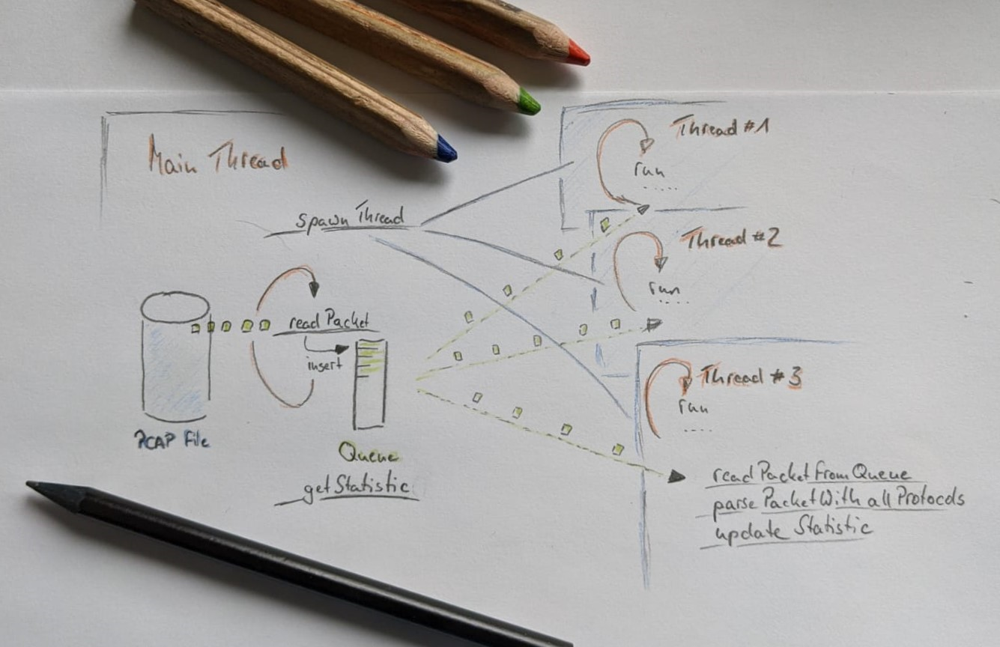
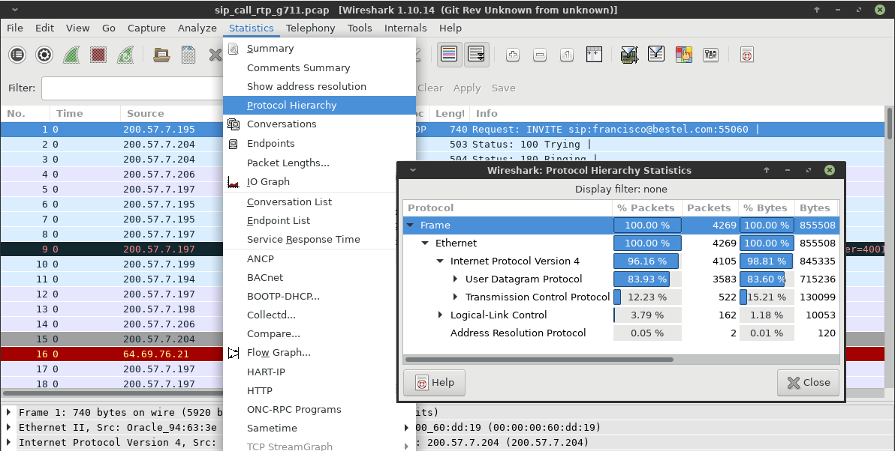

# Interview Assignment #2-2021

You're a new hire at Voipfuture. Sales has reported a huge increase of network bandwidth at our customers so that we need to improve the processing performance of our flag ship product Qrystal to be able to process the higher packet count volume with our Qrystal probes.

After long discussions it has been decided that we first need to get some statistics to fully understand the nature of the bandwidth increase. Your task will be to create a new application that is able to generate the needed statistics about the IP traffic at the customer.

## The Requirements

You are lucky, as some colleague found an old single threaded application that does already something similar. After you have made yourself familiar with the application, you decide to use it as the basis of your new `capstats` application. Because you are the new team member at Voipfuture, you want to proof your programming skills with the best application you have ever done, showing your colleagues how modern C++ and OOP will help to improve the Qrystal product, as well as that your approach will reach the desired scalability and processing performance.

As you are an experienced C++ developer you create for yourself the following design and come up with a requirement list for your solution. You integrate the requirements of the team, who has an interest to understand the contribution of protocol header sizes on the total bandwidth.



## Non-functional requirements

* Programming language: C++14
* Build environment: 64-bit Linux, GCC
* Runtime environment: 64-bit Linux
* Multi-Threaded design using the producer/consumer pattern implemented with OOP / classes
* Configurable number of consumer threads
* The packet processing will be implemented on the consumer threads for highest scalability
* Threads are started just once and remain active until all packets of the file are processed
* The producer thread will read a configurable number of packets before consumer threads start
processing them. The default value shall be 1000 packets. Packets are written to a single queue
that is used by all threads.
* The producer thread will collect the determined statistics from the consumer threads for every
processed chunk of packets and properly merges them into a single result.
* Processing shall repeat with the next configurable chunk of packets until all packets have been
processed
* Once all packets have been processed the application will print out the resulting packet
statistics
* You will use OOP to come up with a protocol parser that can be easily extended but start to
implement it for:
  * Ethernet, IP, TCP and UDP as these protocols shall be statistically evaluated
  * Each protocol parser must be implemented in a dedicated class
  * Each protocol parser must implement the parser interface which consists of the
following methods:
    * parse()
    * type()
  * The parser will be kept simple and is only required to determine:
* Number of bytes in the protocol header of a packet
* Number of packets of a certain protocol
  * Packet parsing is done via the matching protocol parser instance by invoking only the
methods of the parser interface.
* For the output of the application, you create an abstract logger class and provide an
implementation for plain C++ console output.
* The final statistic result shall provide:
  * Packet statistics:
    * Total number of packets
    * Total number of bytes
  * Per protocol statistics:
    * Shall be derived from the packet statistic class and add
      * Percent value of the bytes per protocol
* The application shall receive its runtime configuration via the command line
* Source Code comments and documentation (Doxygen format) will be written in English so that
other developers on our international team can also maintain the code.
* Non-trivial code will be unit-tested. Voipfuture prefers Google Test
(https://github.com/google/googletest/) but can also be something else if it helps you.
* The only dependencies you're going to use are
  * C++ OOP with Standard Library or Qt (https://www.qt.io/download-open-source/)
  * GCC complier

Since Voipfuture has an international team, you prepare yourself to present your implementation and
discuss design choices in English language, if required.

## Quality Assurance

Once the project is done send an email to your team lead. With great respect, the QA (Quality assurance) team will expect the source code, attached as tarball. It includes a readme file, how to build and run the project to be able to continue the acceptance test of your work.

## Old single threaded application

### Build

To build the old single threaded `capstats` project, [CMake](https://cmake.org) will be required. Once those dependency is solved you can call

```bash
$ cmake -S .
$ make
```
to generate the `capstats` binary.

### Run

To run the application pass a capture file as command line argument.
```bash
./capstats sip_call_rtp_g711.pcap

All packets of 'sip_call_rtp_g711.pcap' are parsed

          ip address |       # of packet(s)
     216.155.193.159 |                    1
       207.46.106.82 |                    1
      216.136.173.10 |                    9
     216.155.193.154 |                    1
      207.46.107.165 |                    1
      207.46.106.103 |                    2
        200.57.7.196 |                 1457
      200.73.183.213 |                   16
        200.57.7.195 |                   71
        200.57.7.206 |                    9
     216.155.193.131 |                    1
        200.57.7.198 |                   17
        200.57.7.202 |                   21
        200.57.7.204 |                  782
        200.57.7.188 |                    2
        200.57.7.197 |                  285
        200.57.7.199 |                  936
        200.57.7.194 |                  438
         64.69.76.21 |                    3
        200.57.7.205 |                   52

```

The file provided with this sample code was taken from Wireshark's [capture sample](https://wiki.wireshark.org/SampleCaptures) page.

`sip_call_rtp_g711.pcap` = [SIP_CALL_RTP_G711](https://wiki.wireshark.org/SampleCaptures?action=AttachFile&do=get&target=SIP_CALL_RTP_G711)


## sip_call_rtp_g711

Wireshark has the possibility to even show protocol statistics as followed


